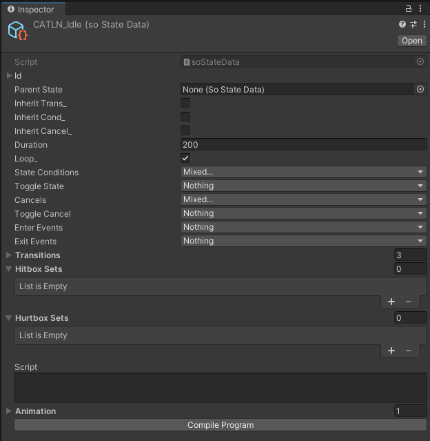
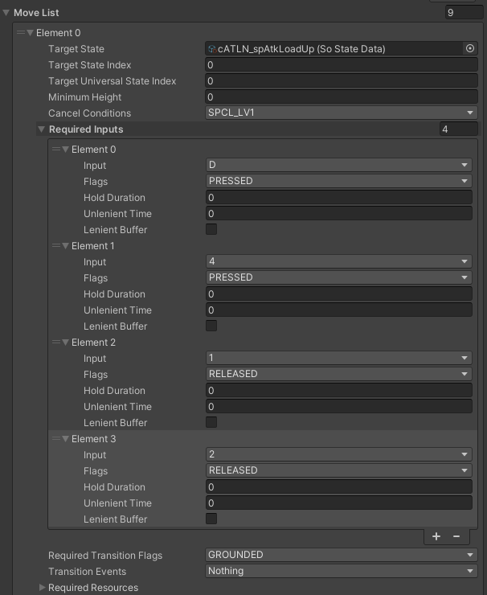
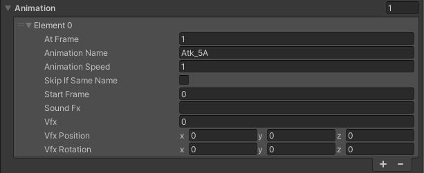

## With Assistance From

Vecderg (UI programming and physics systems), JackTR55555 (dev tools and input system)

## What is this?

This is a project where I attempted to make an in-depth fighting game engine in Unity (currently for 2020.3.34). Given that the alternative to making a fighting game is UFE, I wanted to make something more accessible and deeper, with more freedom and customization

The project uses a fixed-point physics system, allowing for across-the-board determinism. Basically, I'm gonna implement rollback into this thing.

The main backbone of this system is a state machine (what a surprise) but with a twist. The basic concept of this engine is that you DO NOT NEED TO KNOW HOW TO PROGRAM to make something. The functions that you would normally expect to see from a state machine are still there, but they're handled with enums and ints than regular code.

Transitions can be made with various requirements being inputs, becoming grounded, immediately after state ends, or any combination of conditions!

Inputs can be customized to be whatever you want them to be, from weird inputs like Acana Hearts's pentagrams to SNK's pretzels, the input system is flexible and fluid! 
A backwards-quarter-circle shown:

There is some scripting involved, however. As part of an effort to mimic the Arc Systemworks's BB script, the frames can be individually scripted for changes relating to the state machine or for gameplay, such as setting hit/hurtbox dimesions, manipulating resources, changing velocity, etc.

.png)

Animations and other rendering related characteristics are also handled in the state and are activated similar to frame scripting.

The physics is a heavily modified version of: 

## Current Status: Pre-Alpha

The Current Status of this engine is still in the preliminary stages of development.

Plans to continue are still up in the air as my life updates, not abandoned, but on the backburner.

## Plans for the future
- State scripts being converted into commands when C# unity loads in, as of now, you need to manually convert them when you open the project.
- Fixing charge inputs, holding down inputs is still being worked on and will be fixed in the future.
- Making the rendering portion of states also be scriptable like the frames.
- Rollback netcode and save-state-based features such as replays, training mode dummies, etc are the next big milestone.
- Updating for more recent versions of Unity, not a priority but will make it more accessible for more people.
- PROPER DOCUMENTATION, if you're using this as a starting point, sorry to say but no documentation yet! A wiki is planned to come in the future, however.

## Getting Started

1) Clone the project
2) Open the project in the latest applicable version of Unity

From this point forward, there is no clear path ahead, as a lot of the features are still under construction.

## Liscense

MIT
